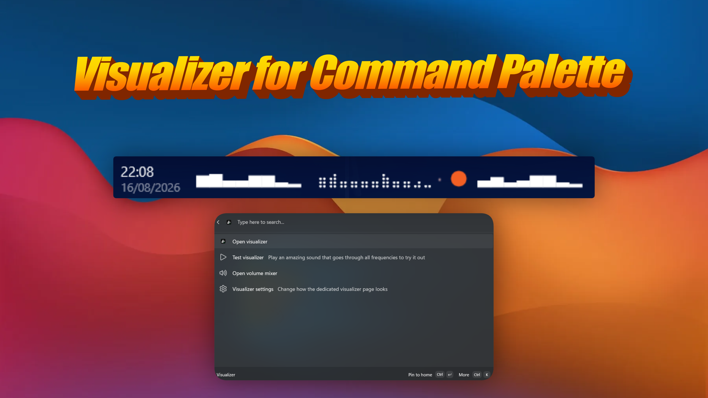
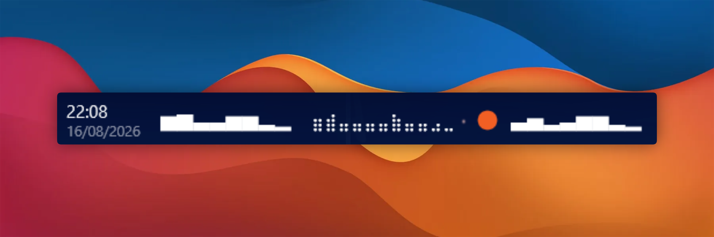
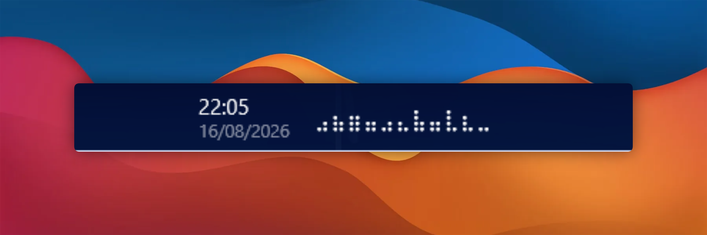
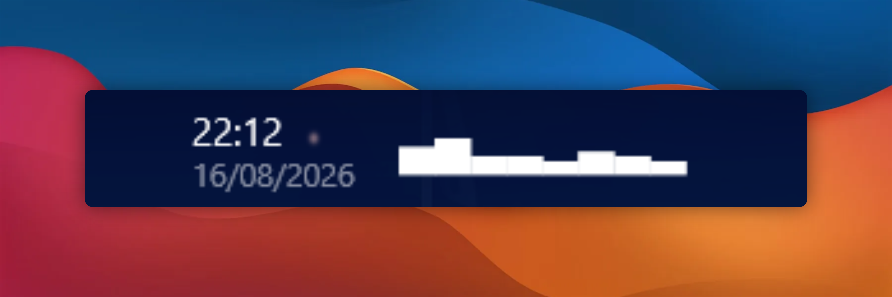

# Visualizer for Command Palette

[](https://github.com/CostaFot/visualizer-extension/releases/latest)
[](https://github.com/CostaFot/visualizer-extension/releases)



A Windows 11 [Command Palette](https://learn.microsoft.com/en-us/windows/powertoys/command-palette/overview) extension that adds a cool little visualizer on the Command Palette dock.

## Requirements
[PowerToys](https://github.com/microsoft/PowerToys) 0.100 or later, with Command Palette enabled

## Installation

### Microsoft Store

<a href="https://apps.microsoft.com/detail/9P2R1MXQP49Z" target="_self">
	
</a>

<!-- TODO after the WinGet submission is merged: uncomment.
### WinGet

```powershell
winget install --id CostaFotiadis.VisualizerForCommandPalette
```
-->

..or download the `.msixbundle` from the [latest release](https://github.com/CostaFot/visualizer-extension/releases/latest). winget when I get to it.

## Features

### Dock bands

Three pinnable styles — block bars, braille, and bars with a VU-colored dot.





### Canvas

Click a band for the full in-palette visualizer — switchable in settings.


## FAQ

**Do you listen/record my microphone while I talk to my mom?**

Thrilling. No.

**Some audio doesn't show up?**

Exclusive-mode and DRM audio never reaches loopback.

**Is there telemetry?**

No.

## License

[MIT](LICENSE)
