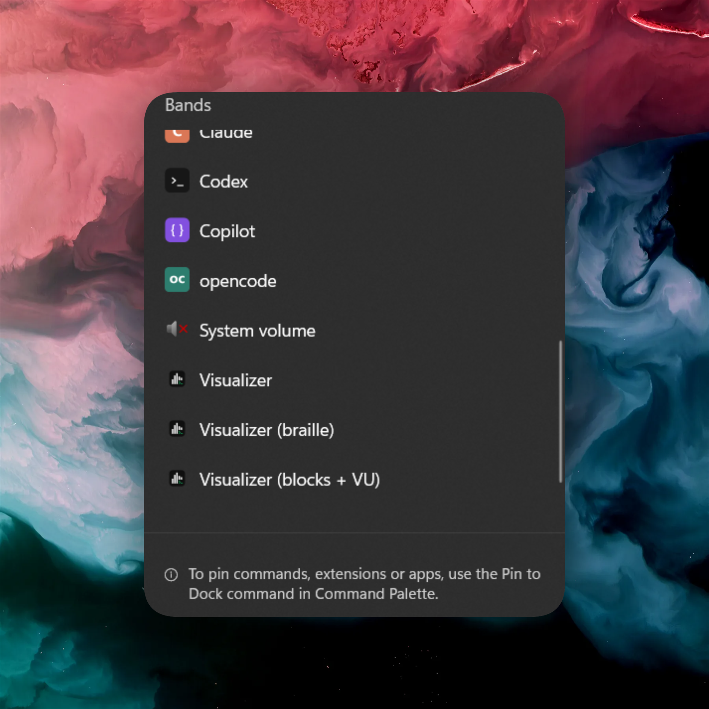

# Visualizer for Command Palette

[](https://github.com/CostaFot/visualizer-extension/releases/latest)
[](https://github.com/CostaFot/visualizer-extension/releases)


A Windows 11 [Command Palette](https://learn.microsoft.com/en-us/windows/powertoys/command-palette/overview) extension that turns whatever your PC is playing into a live spectrum visualizer on the Command Palette dock.

## Requirements
[PowerToys](https://github.com/microsoft/PowerToys) 0.100 or later, with Command Palette enabled

## Installation

<!-- TODO after Store approval: uncomment and fill in the Store ID.
### Microsoft Store

<a href="https://apps.microsoft.com/detail/STORE_ID_HERE" target="_self">
	
</a>
-->

<!-- TODO after the WinGet submission is merged: uncomment.
### WinGet

```powershell
winget install --id CostaFotiadis.VisualizerForCommandPalette
```
-->

Download the `.msixbundle` from the [latest release](https://github.com/CostaFot/visualizer-extension/releases/latest). Store and winget when I get to it.

## Features

### Dock bands

Three pinnable styles — block bars, braille, and bars with a VU-colored dot.



### Canvas

Click a band for the full in-palette visualizer — bars with peak caps or an oscilloscope, switchable in settings.


### Test signal

**Test visualizer** plays a built-in tone sweep so you can see it work with nothing queued up.


## FAQ

**Does it use the microphone?**

No. Loopback capture of your default output device — it only hears what your PC is already playing. Read the source code.

**Some audio doesn't show up?**

Exclusive-mode and DRM audio never reaches loopback. The visualizer follows your default output device.

**Is there telemetry?**

No.

## License

[MIT](LICENSE)
